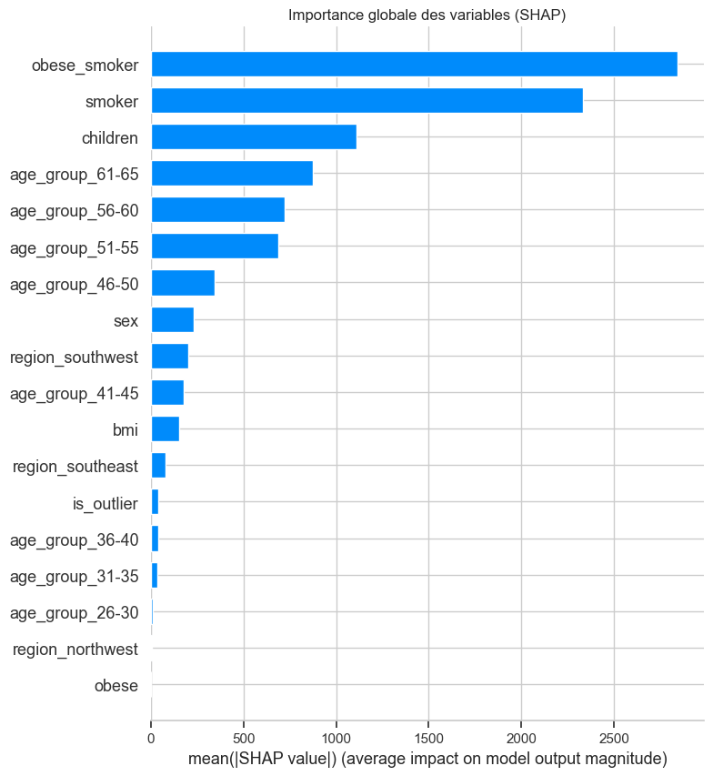
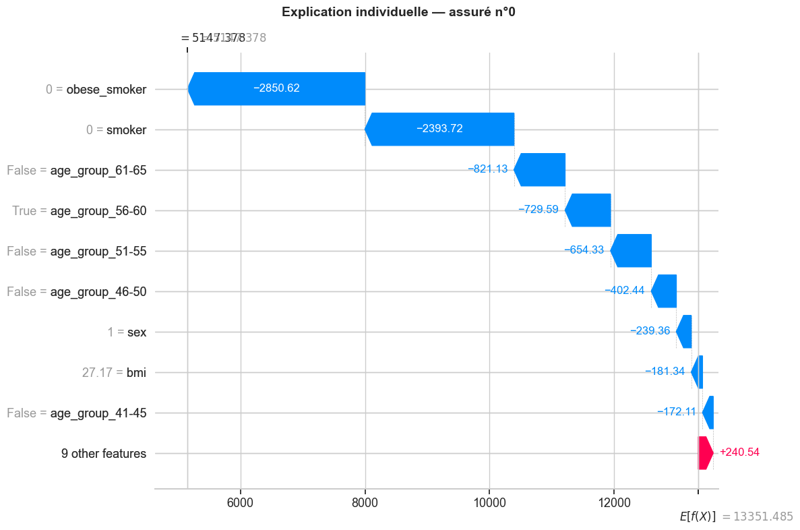

# 📈 Medical Cost Prediction

Ce projet simule une problématique de tarification en assurance santé individuelle.
L'objectif est de construire un modèle capable de prédire les coûts médicaux annuels et d'identifier les principaux facteurs de risque du portefeuille.
Les coûts médicaux individuels sont modélisés dans une démarche de tarification actuarielle — de l'analyse exploratoire et du feature engineering jusqu'à la comparaison de 7 modèles (GLM, Random Forest, XGBoost). 
L'interprétabilité SHAP permet de valider la cohérence des prédictions et d'identifier les principaux facteurs de risque du portefeuille, le waterfall plot décompose chaque prédiction en contributions unitaires par variable, permettant de justifier le tarif calculé en fonction des facteurs de risque.

## Résultats clés

| Modèle | R² | MAE ($) | RMSE ($) |
|--------|----|---------|---------|
| **XGBoost Optimisé** | **0.915** | **2 117$** | **3 494$** |
| XGBoost | 0.902 | 2 230$ | 3 760$ |
| Random Forest | 0.893 | 2 386$ | 3 934$ |
| GLM Tweedie | 0.763 | 3 367$ | 5 849$ |
| GLM Gamma | 0.712 | 4 620$ | 6 445$ |
| Lasso | 0.505 | 3 844$ | 8 447$ |
| Régression Linéaire | 0.498 | 3 866$ | 8 510$ |

## Interprétabilité

Le modèle retenu est XGBoost Optimisé — il explique 91.5% de la variance des coûts avec une erreur moyenne de 2 117$ par assuré.

## 📁 Architecture du Projet

Le code est modulaire :

📂 medical_cost_prediction/
├── 📄 main_notebook.ippy        # Script principal d'exécution et d'analyse
├── 📄 config.py                 # Fichier de paramétrage : chemin et constantes du projet
├── 📄 requirements.txt          # Dépendances du projet
│
├── 📂 data/                      
│    └── medicalcost.csv         # Dataset (1338 assurés, 7 variables)
│
├── 📂 src/                      
│   ├── data_loader.py           # Chargement des données
│   ├── data_quality.py          # Contrôles qualité (missing, outliers, doublons)
│   ├── data_processing.py       # Encodage, split, pipeline
│   ├── features_engineering.py  # Création de variables
│   ├── eda.py                   # Visualisation et tests statistiques
│   ├── models.py                # Entraînement et optimisation des modèles
│   ├── evaluation.py            # Métriques d'évaluation et tableau comparatif
│   └── interpretability.py      # Analyse SHAP
│
├── 📂 output/                  # Graphiques exportés
│                  
└── 📂 models/                      
    └── xgboost_optimized.pkl    # Meilleur modèle sérialisé

## Enseignements clés

- Le statut fumeur est le facteur de risque dominant
- L'interaction obese_smoker est la variable la plus prédictive selon SHAP, un fumeur obèse coûte exponentiellement plus qu'un fumeur non-obèse
- Les GLM actuariels (Tweedie, Gamma) surpassent les régressions linéaires classiques mais sont dominés par les modèles ensemblistes
- La transformation log de `charges` dégrade les performances après back-transformation, modéliser directement `charges` avec une distribution adaptée est préférable

## Limites & perspectives

**Limites**
- Dataset de taille modeste (1 337 observations) — les performances pourraient varier sur un portefeuille réel de plusieurs dizaines de milliers d'assurés
- Absence de dimension temporelle — un modèle de tarification réel intègrerait l'historique des sinistres
- Variables limitées — un portefeuille réel inclurait des données médicales, géographiques et comportementales plus riches

**Perspectives**
- Optimisation du Random Forest avec GridSearchCV
- Test d'un modèle Tweedie avec optimisation du paramètre p
- Ajout d'une analyse de la courbe de Gini et du coefficient de lift